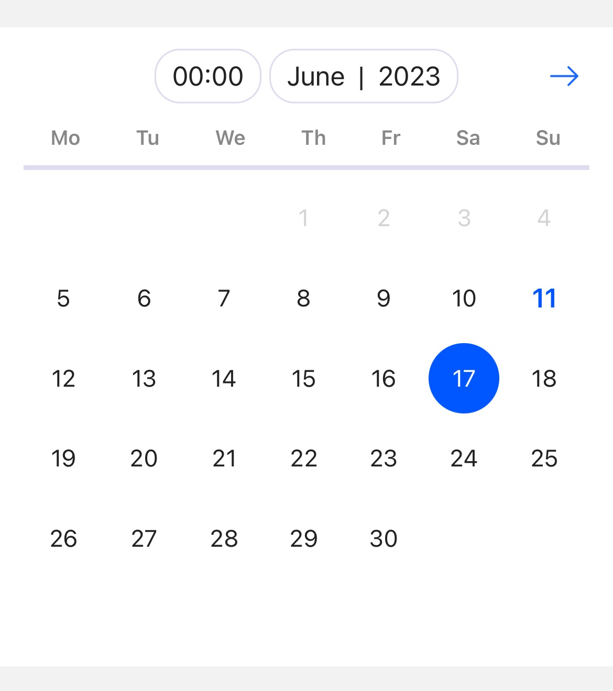
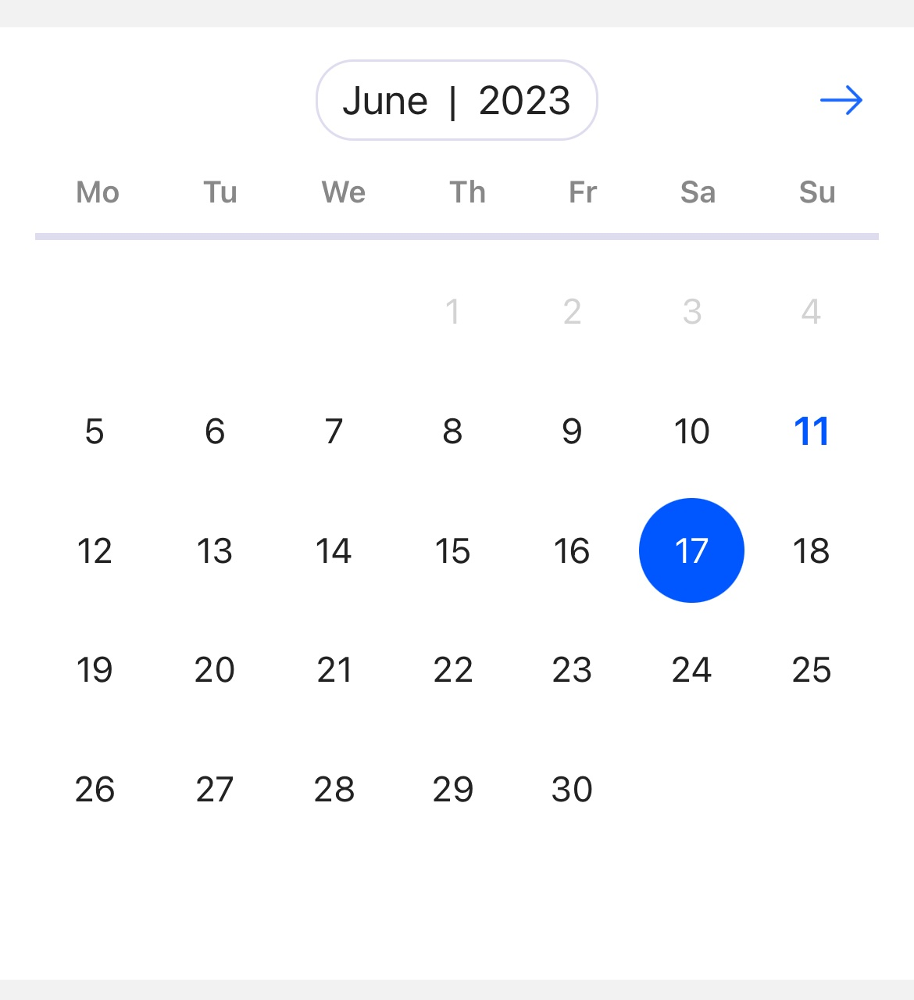
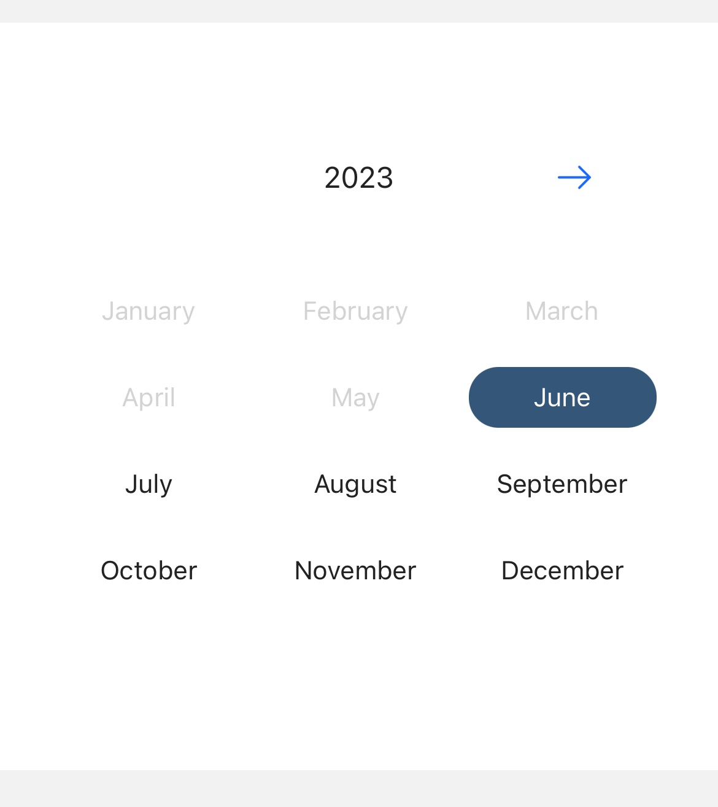
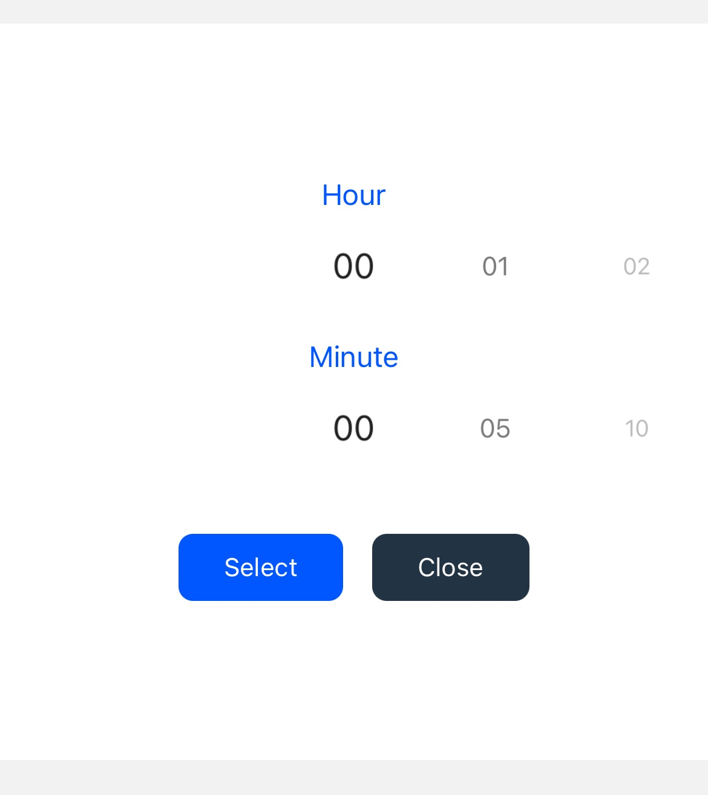

# React Native TX Modern DateTimePicker

   
 

## [Video demo](screenshots/example.m4v)

Forked from HosseinShabani/react-native-modern-datepicker
> A customizable calendar, time & month picker for React Native (including Persian Jalaali calendar & locale). For more information, please visit [website](https://hosseinshabani.github.io/react-native-modern-datepicker)

## Installation
```
npm i react-native-tx-modern-datetimepicker
```
```
yarn add react-native-tx-modern-datetimepicker
```

## Fixed and improve
1. Fixed year input: user can now clear all year in input text and it also handle if the user remove focus on input text without value, the default value will be the current year.
https://github.com/HosseinShabani/react-native-modern-datepicker/pull/133
2. Fixed the animation issue: When you click the right arrow It slides right to left and vice-versa for the left arrow click.
https://github.com/HosseinShabani/react-native-modern-datepicker/pull/110
3. Remove moment-jalaali. Using: moment. Default language: English
4. Add @type. (Now, we have suggestion of `configs` and `options` properties)
5. Add multiple style for text and view. Customize the UI as you like. In `options` prop
```
textHeaderStyle?: StyleProp<TextStyle>
textHeaderStyle?: StyleProp<TextStyle>
textDayNamesStyle?: StyleProp<TextStyle>
textDayStyle?: StyleProp<TextStyle>
textDaySelectedStyle?: StyleProp<TextStyle>
textTodayStyle?: StyleProp<TextStyle>
textMonthStyle?: StyleProp<TextStyle>
textActionTimeStyle?: StyleProp<TextStyle>
viewDaysNameStyle?: StyleProp<ViewStyle>
viewDaysContainerStyle?: StyleProp<ViewStyle>
viewDayItemStyle?: StyleProp<ViewStyle>
viewDayItemSelectedStyle?: StyleProp<ViewStyle>
viewHeaderItemStyle?: StyleProp<ViewStyle>
viewHeaderContainerStyle?: StyleProp<ViewStyle>
viewButtonActionSelectTimeStyle?: StyleProp<ViewStyle>
viewButtonActionCancelTimeStyle?: StyleProp<ViewStyle>
viewButtonsActionTimeStyle?: StyleProp<ViewStyle>
viewMonthItemSelectedStyle?: StyleProp<ViewStyle>
viewMonthItemStyle?: StyleProp<ViewStyle>
imageArrow?: StyleProp<ImageStyle>
inputYearStyle?: StyleProp<TextInput>
```
6. Bonus: in `configs` prop: `textSeparatorMonthYear` will show `${month}${textSeparatorMonthYear}${year}` in header

## Usage

### Date and time picker
```jsx
import DatePicker, {
	ModernDateTimePickerConfig,
	ModernDateTimePickerOptions,
} from 'react-native-tx-modern-datetimepicker'

const pickerOptions: ModernDateTimePickerOptions = {
	mainColor: '#0057FF',
	daysAnimationDistance: 300,
	headerAnimationDistance: 200,
	borderColor: '#dde',
	textDayNamesStyle: {
		fontWeight: '600',
		color: '#888',
		fontSize: 13,
	},
	viewDaysNameStyle: {
		borderBottomWidth: 3,
	},
	viewHeaderItemStyle: {
		borderWidth: 1,
		borderRadius: 16,
	},
	textDayStyle: {
		fontSize: 15,
	},
	textTodayStyle: {
		fontSize: 17,
		fontWeight: '600',
	},
	textHeaderStyle: {
		fontSize: 17,
	},
	viewMonthItemSelectedStyle: {
		borderRadius: 16,
		backgroundColor: '#345678',
		paddingVertical: 8,
	},
	imageArrow: {},
}

// if mode === time or mode === datetimepicker
// selectedFormat = dateFormat + ' ' + timeFormat (automatic)
const pickerConfig: ModernDateTimePickerConfig = {
	dateFormat: 'YYYYMMDD',
	selectedFormat: 'YYYYMMDD',
	textSeparatorMonthYear: ' | ',
	timeFormat: 'HH:mm',
}

<DatePicker
	current={'20230608'} // init focus month
	selected={'20230617 12:18'} // init date and time
	minimumDate={'20230605'}
	mode={'dateTimePicker'}
	minuteInterval={1}
	onDateChange={(d) => {
		console.log('onDateChange', d)
	}}
	onTimeChange={(d) => {
		console.log('onTimeChange', d)
	}}
	onMonthYearChange={(d) => {
		console.log('onMonthYearChange', d)
	}}
	onSelectedChange={(d) => {
		console.log('onSelectedChange', d)
	}}
	configs={pickerConfig}
	options={pickerOptions}
/>
```

### Only time picker
```jsx
<DatePicker
	mode={'time'}
	minuteInterval={1}
	onTimeChange={(d) => {
		console.log('onTimeChange', d)
		setTimeSelected(d)
	}}
	configs={pickerConfig}
	options={{
		...pickerOptions,
		viewButtonActionSelectTimeStyle: {
			backgroundColor: 'green',
			borderRadius: 8,
			width: Dimensions.get('window').width - 32,
			marginHorizontal: 32,
			justifyContent: 'center',
			alignItems: 'center',
			height: 48,
		},
		textActionTimeStyle: {
			fontSize: 16,
			fontWeight: '500',
		},
	}}
/>
```

### Date and time picker in modal
```jsx
const [visibleModal, setVisibleModal] = useState(false)
const [dateSelectedModal, setDateSelectedModal] = useState('20230618')
const [timeSelectedModal, setTimeSelectedModal] = useState('00:00')

<Button title="Show modal" onPress={() => setVisibleModal(true)} />

<Modal visible={visibleModal} transparent animationType={'slide'}>
	<View style={{ flex: 1, backgroundColor: '#00000022', justifyContent: 'flex-end' }}>
		<View style={{ height: 500, backgroundColor: 'white' }}>
			<DatePicker
				current={'20230608'} // init focus month
				selected={`${dateSelectedModal} ${timeSelectedModal}`} // init date and time
				minimumDate={'20230605'}
				mode={'dateTimePicker'}
				minuteInterval={1}
				onDateChange={(d) => {
					console.log('onDateChange', d)
					setDateSelectedModal(d)
					setVisibleModal(false)
				}}
				onTimeChange={(d) => {
					console.log('onTimeChange', d)
					setTimeSelectedModal(d)
				}}
				onMonthYearChange={(d) => {
					console.log('onMonthYearChange', d)
				}}
				onSelectedChange={(d) => {
					console.log('onSelectedChange', d)
				}}
				configs={pickerConfig}
				options={pickerOptions}
			/>
			<Button title={'Close modal'} onPress={() => setVisibleModal(false)} />
		</View>
	</View>
</Modal>
```
